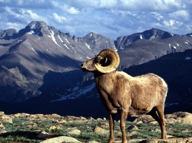
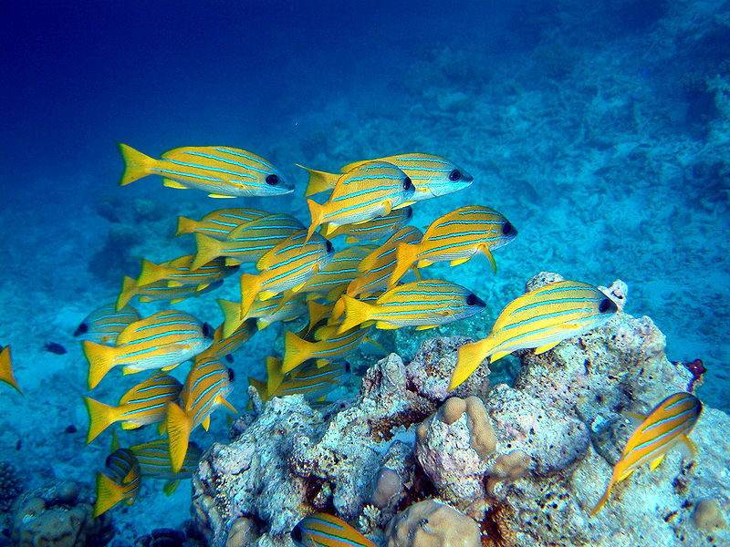
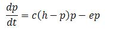
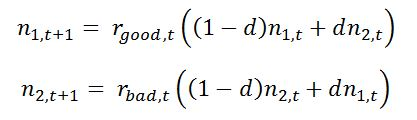

### Link your theory in here

#### Metapopulation:
Metapopulation is a population in which individuals are spatially distributed in a habitat in two or more subpopulations. Populations of butterflies and coral-reef fishes are good examples of metapopulation . Human activities and natural disasters are the main causes of metapopulation and increase the population that occurs as metapopulatons. Such factors cause the fragmentation of a  large habitat into patches. This may be an important reason whereby models of metapopulation dynamics become important methods/tools in the field of conservation biology.

&nbsp;

Mountain Sheep                                                                    

Coral-reef fishes

Image source: http://en.wikipedia.org

Populations of species like Mountain Sheep occupy patches of high quality habitat and they move from one patch to another only due to some factors of attraction. These species are distributed to a number of populations that are either isolated or have some exchange of individuals. Such a collection of populations and its dynamics is called metapopulation dynamics. Each local habitat in a metapopulation is referred as subpopulations.

&nbsp;

### Levins Model:

The concept of metapopulation was introduced by Richard Levins (an American ecologist) in 1969. The Levins model is based on a population in which individuals reproduce and die within local patches of the habitat, and their offspring disperse into other patches. 

The current most popular approach is based on the metapopulation concept (Levins 1969) and on the study of metapopulation dynamics (for reviews, see Hanski 1994, Hastings and Harrison 1994, Hanski and Gilpin 1997).  An important assumption is that all local populations have a significant risk of extinction. In other words, the metapopulation is in a stochastic equilibrium between local extinctions and colonizations of currently empty land with suitable habitat patches. The migration of an individual depends on distance and spatial configuration of the landscape and affects metapopulation dynamics, which are not included in Levins model. In Levins model assume that 
1. metapopulation exists in a homogeneous habitat again divided into subpopulations 
2. the young disperse randomly within the habitat.

Proportion of patches that are occupied (p) in Levins model is given by the differential equation.

Where h is the total number of patches present in the habitat, p is the Initial number of patches that are occupied, 1-p is the proportion of patches that are vacant, c is the rate at which occupied patches produce colonies, cp(1-p) is the rate at which vacant patches become occupied patches, e is the rate at which an occupied patch goes extinct.

&nbsp;

### Metapopulation Stability:

Metapopulations are stable for long time. The growth rate in subpopulation in a heterogeneous environment will vary accordingly with local conditions. The population as a whole is stable to an extent because of the dispersal of individuals within the habitat.

There are two ways to study the effect of local environment on the stability of metapopulation.

1. The population growth of one subpopulation is independent from other one. The information about the dynamics of growth of one subpopulation will not give any information about any other subpopulation in metapopulation.

2. The quality of local environment is negatively correlates with the quality of another local environment.

With assumptions, reproduction is seasonal and growth occurs in discrete time.  Considering such population divided into subpopulation, each producing under unique set of environmental conditions with different growth rate. Two such subpopulation inter connected by dispersal, the discrete equations of growth rate are,

&nbsp;

                                                   

Butterflies

&nbsp;

Where d is the dispersal, probability that the individual disperse from its sub population, I is the degree to which the environments of the two subpopulations vary with regards to each other, rgood is the population growth rate in good years, rbad is the population growth rate in bad years, n1 and n2 are the initial size of the populations. The time period is denoted by t. (1 - d) is that the population will not be dispersed. The value of d equal to or greater than 0.5, the two population completely mixed, the population is considered as single population rater than two subpopulations. 
 